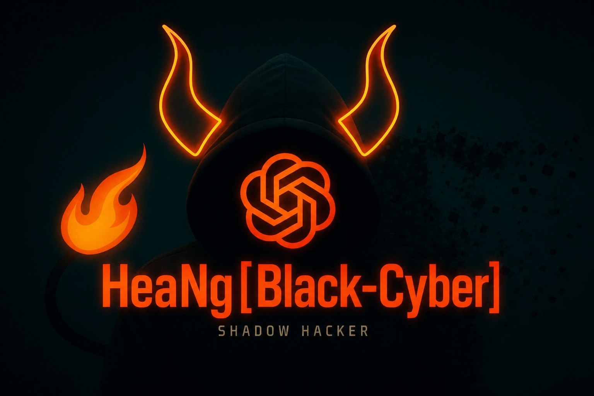

# HeaNg[Black-Cyber] AI Bot - AI Telegram Assistant

<div align="center">
  
</div>
A powerful Telegram bot powered by HeaNg[Black-Cyber] AI with conversation history and persistent storage.

## ✨ Features

- 🤖 **AI Assistant**: Powered by OpenRouter (supports multiple AI models)
- 💬 **Conversation History**: SQLite database stores all messages
- 🔍 **View History**: `/history` command shows past conversations
- 🔐 **Secure Configuration**: Environment variables for all secrets
- ☁️ **Cloud Ready**: Deployable on Render.com
- 📱 **Telegram Native**: Full Telegram Bot API integration
- ⚡ **Fast Responses**: Optimized for quick interactions

## 🚀 Quick Start

### Local Development

#### 1. Clone Repository
```bash
git clone https://github.com/Mengheang25/HeaNg-Black-Cyber-AI-bot.git
cd HeaNg-Black-Cyber-AI-bot
```

#### 2. Create Environment
```bash
python -m venv venv
source venv/bin/activate  # Linux/Mac
# or
venv\Scripts\activate  # Windows
```

#### 3. Install Dependencies
```bash
pip install -r requirements.txt
```

#### 4. Configure Environment
```bash
cp .env.example .env
# Edit .env with your credentials
```

#### 5. Run Bot
```bash
python main.py
```

### Cloud Deployment

Deploy to Render.com in 5 minutes:

1. **Push code to GitHub**
2. **Sign up on [Render.com](https://render.com)**
3. **Follow [RENDER_DEPLOYMENT.md](RENDER_DEPLOYMENT.md)**

## 📋 Configuration

### Required Environment Variables
```env
TELEGRAM_TOKEN=your_telegram_bot_token
OPENROUTER_KEY=your_openrouter_api_key
```

### Optional Configuration
```env
MODEL_NAME=deepseek/deepseek-v4-flash        # AI model to use
BASE_URL=https://openrouter.ai/api/v1        # API endpoint
DATABASE_PATH=date_user.db                   # Database file location
ENABLE_HISTORY=true                          # Enable/disable history
```

## 📖 Usage

### Commands

| Command | Description |
|---------|-------------|
| `/start` | Initialize bot and show welcome message |
| `/history` | View last 20 conversation messages |

### Regular Messages

Simply send any message to the bot and it will respond with AI-generated answers.

## 🗄️ Database

### SQLite Database Structure

**Users Table**
- `user_id` (PRIMARY KEY)
- `first_name` (user's first name)
- `username` (Telegram username)
- `created_at` (registration timestamp)

**Conversations Table**
- `id` (PRIMARY KEY, auto-increment)
- `user_id` (FOREIGN KEY to users)
- `message_type` ('user' or 'ai')
- `content` (message text)
- `timestamp` (when message was created)

### Backup Database
```bash
cp date_user.db date_user_backup_$(date +%Y%m%d_%H%M%S).db
```

### View Database
```python
import sqlite3

conn = sqlite3.connect('date_user.db')
cursor = conn.cursor()

# View all conversations
cursor.execute('SELECT * FROM conversations LIMIT 10')
for row in cursor.fetchall():
    print(row)

conn.close()
```

## 🛠️ Technologies

- **Python 3.11+**: Programming language
- **python-telegram-bot**: Telegram Bot API wrapper
- **requests**: HTTP library for API calls
- **sqlite3**: Conversation database
- **python-dotenv**: Environment variable management
- **OpenRouter**: AI API provider

## 📚 Documentation

- **[SECURITY.md](SECURITY.md)** - Security setup and best practices
- **[IMPLEMENTATION.md](IMPLEMENTATION.md)** - Technical implementation details
- **[QUICK_REFERENCE.md](QUICK_REFERENCE.md)** - Quick command reference
- **[RENDER_DEPLOYMENT.md](RENDER_DEPLOYMENT.md)** - Render.com deployment guide

## 🔐 Security

✅ **Best Practices Implemented**
- Environment variable configuration
- `.env` file never committed (`.gitignore`)
- Secure credential validation
- UTF-8 encoding for all platforms
- Error handling and logging

⚠️ **Keep These Secure**
- Never share `TELEGRAM_TOKEN`
- Never share `OPENROUTER_KEY`
- Keep `.env` file private
- Don't commit secrets to git

## 📊 Project Structure

```
HeaNg-Black-Cyber-AI-bot/
├── main.py                      # Main bot code
├── requirements.txt             # Python dependencies
├── Procfile                     # Render.com deployment
├── render.yaml                  # Render.com configuration
├── .env.example                 # Environment template
├── .gitignore                   # Git ignore rules
├── system-prompt.txt            # AI system prompt
├── date_user.db                 # SQLite database
├── SECURITY.md                  # Security guide
├── IMPLEMENTATION.md            # Implementation reference
├── QUICK_REFERENCE.md           # Quick reference
├── RENDER_DEPLOYMENT.md         # Deployment guide
└── README.md                    # This file
```

## 🚀 Deployment Options

### Option 1: Render.com (Recommended)
- Free tier available
- Automatic scaling
- Persistent storage included
- [See deployment guide](RENDER_DEPLOYMENT.md)

### Option 2: Local Server
- Full control
- No cloud dependencies
- Requires 24/7 uptime management
- Run: `python main.py`

### Option 3: Docker
```dockerfile
FROM python:3.11-slim
WORKDIR /app
COPY requirements.txt .
RUN pip install -r requirements.txt
COPY . .
CMD ["python", "main.py"]
```

## 🧪 Testing

### Test Bot Locally
```bash
# 1. Start bot
python main.py

# 2. Open Telegram and find bot
# 3. Send `/start` command
# 4. Bot should respond with welcome message
# 5. Send a test message
# 6. Check `/history`
```

### Test Database
```bash
# View database
sqlite3 date_user.db "SELECT * FROM conversations LIMIT 5;"

# Backup database
cp date_user.db date_user_backup.db

# Clear history (if needed)
sqlite3 date_user.db "DELETE FROM conversations; DELETE FROM users;"
```

## 📈 Monitoring

### Local Development
- Check console output for errors
- Monitor database file size
- Review system prompt effectiveness

### Production (Render.com)
- Use Render dashboard logs
- Monitor service metrics
- Set up alerts for errors

## 🐛 Troubleshooting

### Bot Not Responding
1. Check `TELEGRAM_TOKEN` is correct
2. Verify internet connection
3. Check bot logs for errors
4. Restart bot: `Ctrl+C` then `python main.py`

### Database Errors
1. Check database file permissions
2. Ensure disk space available
3. Review error logs
4. Try backing up and recreating database

### API Errors
1. Verify `OPENROUTER_KEY` is valid
2. Check API rate limits
3. Monitor API logs
4. Test API directly: `curl https://openrouter.ai/api/v1/models`

### Encoding Issues
1. Ensure UTF-8 encoding
2. Check terminal supports Unicode
3. Use `PYTHONUNBUFFERED=1` environment variable

## 📞 Support & Resources

- **Telegram Bot API**: [core.telegram.org/bots](https://core.telegram.org/bots)
- **OpenRouter**: [openrouter.ai](https://openrouter.ai)
- **Render Docs**: [docs.render.com](https://docs.render.com)
- **Python Docs**: [python.org](https://python.org)

## 📝 Version History

### v2.0 (Current)
- ✅ Environment variable configuration
- ✅ SQLite conversation history
- ✅ `/history` command
- ✅ Render.com deployment ready
- ✅ Unicode encoding fixes
- ✅ Comprehensive documentation

### v1.0 (Original)
- Memory-based messaging
- Hardcoded credentials
- No history retention

## 📄 License

MIT License - feel free to use and modify

## 🤝 Contributing

Contributions welcome! Please:
1. Fork the repository
2. Create feature branch (`git checkout -b feature/amazing-feature`)
3. Commit changes (`git commit -m 'Add amazing feature'`)
4. Push to branch (`git push origin feature/amazing-feature`)
5. Open Pull Request

## ⭐ Stars & Support

If you find this project useful, please:
- ⭐ Star the repository
- 🔔 Watch for updates
- 📤 Share with others
- 🐛 Report bugs
- 💡 Suggest features

## 👨‍💻 Creator

**Developer**: [Mengheang](https://t.me/mengheang25)

---

**Get started in 3 minutes:**
1. `cp .env.example .env` - Create config
2. Edit `.env` - Add your tokens
3. `python main.py` - Run bot!

**Deploy to cloud in 5 minutes:**
See [RENDER_DEPLOYMENT.md](RENDER_DEPLOYMENT.md) for Render.com setup.
